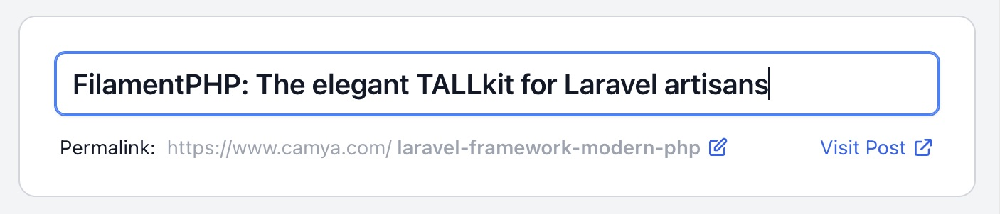
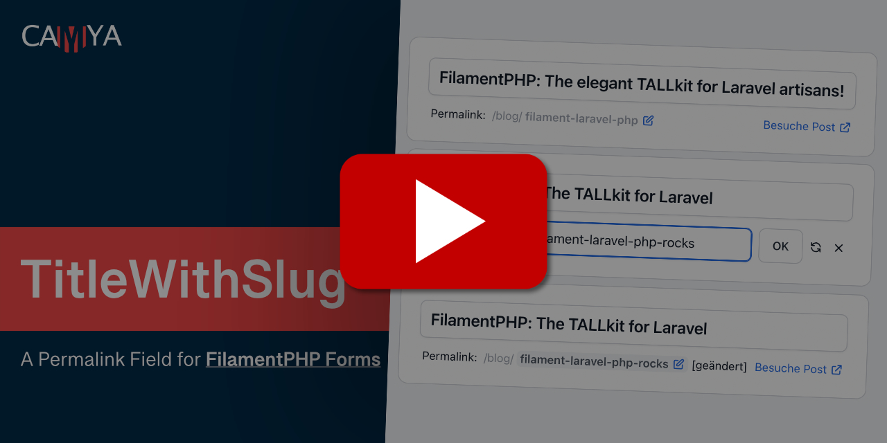
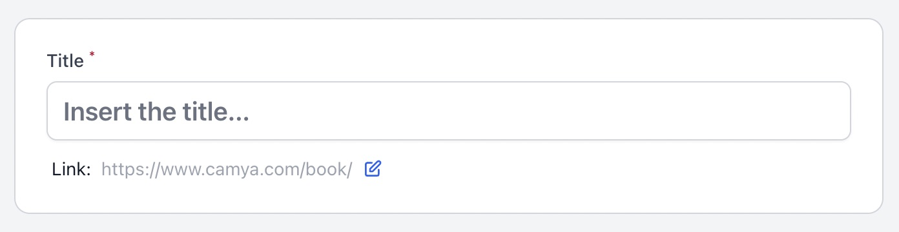
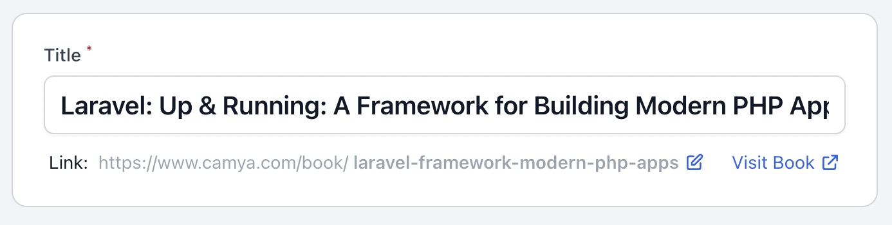
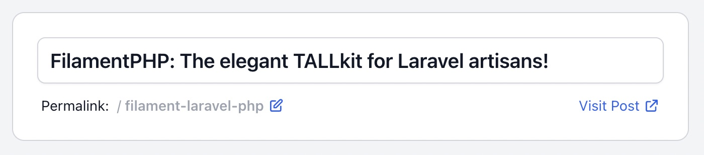
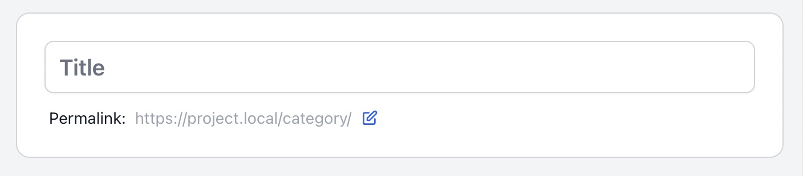
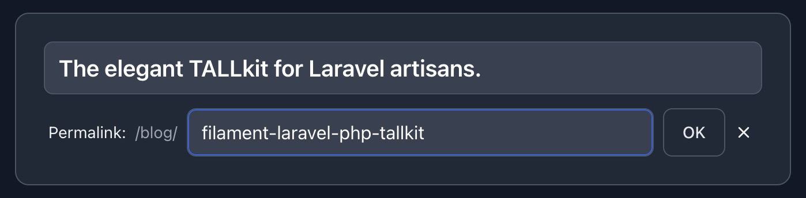
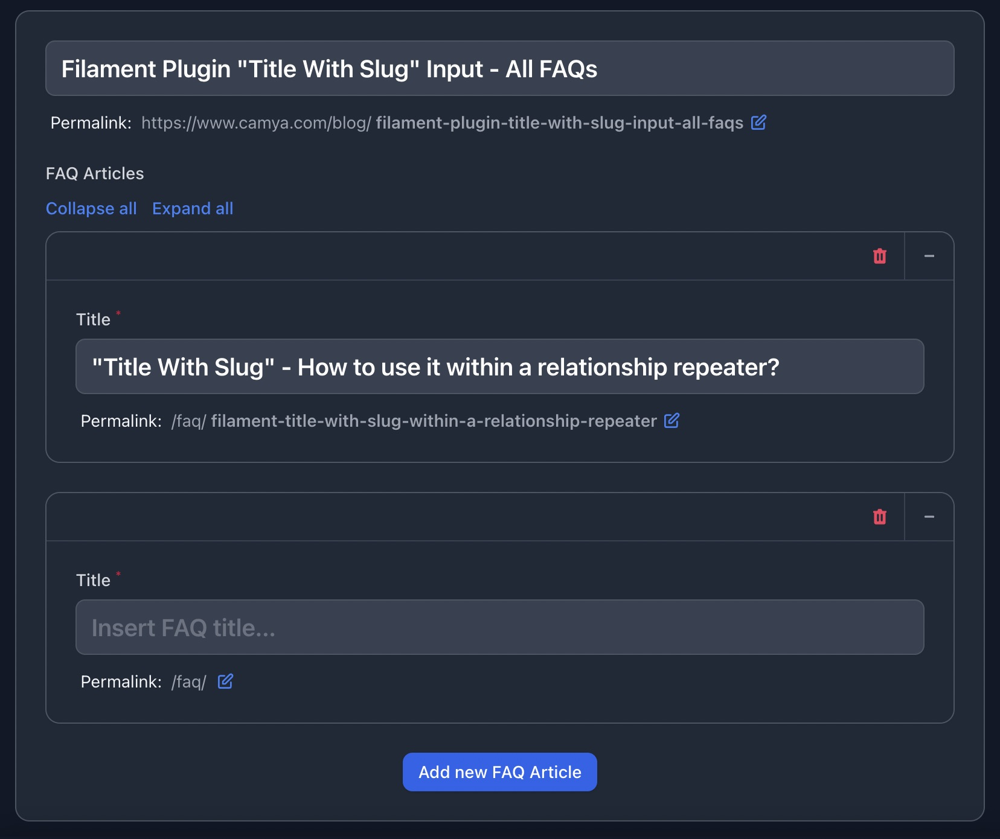
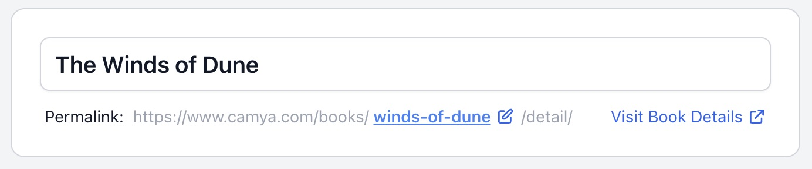

# "Title With Slug" Input - Easy Permalink Slugs for Filament Forms (PHP / Laravel / Livewire)

This package for [FilamentPHP](https://filamentphp.com/plugins/title-with-slug-permalink) adds the form component `TitleWithSlugInput` which allows to
edit titles and slugs easily.

It is inspired by the classic **WordPress title & slug** implementation.

The plugin is fully configurable. You can change all labels, use your own slugifier, use a route() to generate the "
View" link, hide the host name, and many more. Read the [full documentation](#installation)

```php
TitleWithSlugInput::make(
    fieldTitle: 'title', // The name of the field in your model that stores the title.
    fieldSlug: 'slug', // The name of the field in your model that will store the slug.
),
```

The output looks like this: (Watch **[&raquo; Demo Video &laquo;](https://www.youtube.com/watch?v=5u1Nepm2NiI)**)




## Features

- Slug edit form.
- "Visit" link to view the generated URL.
- Auto-generates the slug from the title, if it has not already been manually updated.
- Undo an edited slug.
- All texts customizable and translatable.
- Dark Mode supported.
- Fully configurable, see [all available parameters](#all-available-parameters).

## Video

You can watch a short demo video of the packages below.

[](https://www.youtube.com/watch?v=5u1Nepm2NiI)

## Support us

You can support my work with a [donation](https://www.paypal.com/paypalme/epicbundle).

[Follow me on Twitter](https://twitter.com/camyaCom) for DEV updates.

Support the package: Please give it a &#11088; Star on GitHub and on the official
Filament [plugin page](https://filamentphp.com/plugins/title-with-slug-permalink), if it's helpful for you.

Visit the plugin's [Composer Packagist page](https://packagist.org/packages/camya/filament-title-with-slug) (The PHP Package Repository) for the current install count and more.

## Table of contents

- [Installation](#installation)
- [Usage & examples](#usage--examples)
    - [Basic usage - Add TitleWithSlugInput to a Filament Form](#basic-usage---add-titlewithsluginput-to-a-filament-form)
    - [Change model fields names](#change-model-fields-names)
    - [Change labels, titles, placeholder](#change-labels-titles-placeholder)
    - [Permalink preview: Hide host](#permalink-preview-hide-host)
    - [Permalink preview: Change host and path](#permalink-preview-change-host-and-path)
    - ["Visit" link - Use router to generate URL with route()](#visit-link---use-router-to-generate-url-with-route)
    - [Hide "Visit" link](#hide-visit-link)
    - [Style the "title" input field](#style-the-title-input-field)
    - [Add extra validation rules for title or slug](#add-extra-validation-rules-for-title-or-slug)
    - [Custom error messages](#custom-error-messages)
    - [Custom unique validation rules for title (and slug)](#custom-unique-validation-rules-for-title-and-slug)
    - [Custom slugifier](#custom-slugifier)
    - [Dark Mode](#dark-mode)
    - [How to set a empty homepage slug](#how-to-set-a-empty-homepage-slug)
    - [Use within a relationship repeater](#use-within-a-relationship-repeater)
    - [Make a URL slug sandwich. (path/slug/path)](#make-a-url-slug-sandwich-pathslugpath)
    - [Use the slug as subdomain](#use-the-slug-as-subdomain)
    - [Package config file - Set default values](#package-config-file---set-default-values)
    - [**All available parameters**](#all-available-parameters)
- [Changelog](#changelog)
- [Contributing](#contributing)
- [Credits](#credits)

## Installation

You can install the package via composer:

```bash
composer require camya/filament-title-with-slug
```

If needed, you can publish the config file with:

```bash
php artisan vendor:publish --tag="filament-title-with-slug-config"
```

## Translation

If needed, you can publish the translation files with:

```bash
php artisan vendor:publish --tag="filament-title-with-slug-translations"
```

You'll find the published translations here: `trans/vendor/filament-title-with-slug`

This package is translated
to:

- [English (en)](https://github.com/camya/filament-title-with-slug/blob/main/resources/lang/en/package.php)
- [French (fr)](https://github.com/camya/filament-title-with-slug/blob/main/resources/lang/fr/package.php)
- [Brazilian Portuguese (pt_BR)](https://github.com/camya/filament-title-with-slug/blob/main/resources/lang/pt_BR/package.php)
- [German (de)](https://github.com/camya/filament-title-with-slug/blob/main/resources/lang/de/package.php)
- [Dutch (nl)](https://github.com/camya/filament-title-with-slug/blob/main/resources/lang/nl/package.php)
- [Indonesian (id)](https://github.com/camya/filament-title-with-slug/blob/main/resources/lang/id/package.php)
- [Arabic (ar)](https://github.com/camya/filament-title-with-slug/blob/main/resources/lang/ar/package.php)

You translated it too? Share your translation on
our [GitHub discussions](https://github.com/camya/filament-title-with-slug/discussions) page.

## Usage & examples

### Basic usage - Add TitleWithSlugInput to a Filament Form

This package provides the custom InputField `TitleWithSlugInput` for the **Filament Form Builder**.

Read the [installation details for Filament](https://filamentphp.com/docs/2.x/admin/installation) here.

Below an example, where to put the new field inside your Filament Resource.

- `fieldTitle`: The name of the field in your model that stores the title.
- `fieldSlug`: The name of the field in your model that will store the slug.

```php

use Camya\Filament\Forms\Components\TitleWithSlugInput;

class PostResource extends Resource
{
    public static function form(Form $form): Form
    {
        return $form->schema([
        
            TitleWithSlugInput::make(
                fieldTitle: 'title',
                fieldSlug: 'slug',
            )
            
        ]);
    }
}
```

> **Tip:** To occupy the full width, use `TitleWithSlugInput::make()->columnSpan('full')`.

The output looks like this:


### Change model fields names

The package assumes, that you model fields are named `title` and `slug`.

You can easily change them according to your needs.

In the example below, the package now uses the database fields `name` for the title and `identifier` for the slug.

```php
\Camya\Filament\Forms\Components\TitleWithSlugInput::make(
    fieldTitle: 'name',
    fieldSlug: 'identifier',
)
```

### Change labels, titles, placeholder

It's possible to change all labels on the fly.

In this example, we also add the base path `/books/`.

```php
\Camya\Filament\Forms\Components\TitleWithSlugInput::make(
    urlPath: '/book/',
    urlVisitLinkLabel: 'Visit Book',
    titleLabel: 'Title',
    titlePlaceholder: 'Insert the title...',
    slugLabel: 'Link:',
)
```

> Tip: You can [translate the package](#contributing) completely.

The output looks like this:




### Permalink preview: Hide host

You can hide the host part of the permalink preview.

```php
\Camya\Filament\Forms\Components\TitleWithSlugInput::make(
    urlHostVisible: false,
)
```

The output looks like this:



### Permalink preview: Change host and path

You can set the path and the host for the preview.

```php
\Camya\Filament\Forms\Components\TitleWithSlugInput::make(
    urlPath: '/category/',
    urlHost: 'https://project.local',
)
```

The output looks like this:



### "Visit" link - Use router to generate URL with route()

You can use a named route, e.g. `route('product.show', ['slug' => $record->slug])`, to generated the "Visit" link.

```php
\Camya\Filament\Forms\Components\TitleWithSlugInput::make(
    urlPath: '/product/',
    urlHost: 'camya.com',
    urlVisitLinkRoute: fn(?Model $record) => $record?->slug 
        ? route('product.show', ['slug' => $record->slug])
        : null,
)
```

Laravel documentation: 
[Generating URLs To Named Routes](https://laravel.com/docs/9.x/routing#generating-urls-to-named-routes)

By default, the package concatenates the strings `host + path + slug` to generate the "Visit" link.

Because the "Visit" link now is generated by an route, you can use partial hosts like `urlHost: 'camya.com'` to shorten
the permalink preview.

The output looks like this:


### Hide "Visit" link

You can remove the "Visit" link completely.

```php
\Camya\Filament\Forms\Components\TitleWithSlugInput::make(
    urlVisitLinkVisible: false,
)
```

### Style the "title" input field

In order to style the "title" input field, you can pass the attributes `class` via `titleExtraInputAttributes`
parameter.

```php
\Camya\Filament\Forms\Components\TitleWithSlugInput::make(
    titleExtraInputAttributes: ['class' => 'italic'],
)
```

The output looks like this:


### Add extra validation rules for title or slug

You can add additional validation rules by passing in the variables `titleRules` or `slugRules`.

In addition, a unique validation rule is applied to the slug field automatically. In order to modify the unique rule,
read [Custom unique validation rules for title (and slug)](#custom-unique-validation-rules-for-title-and-slug).

```php
\Camya\Filament\Forms\Components\TitleWithSlugInput::make(
    titleRules: [
        'required',
        'string',
        'min:3',
        'max:12',
    ],
)
```

You can also [customize the error messages](#custom-error-messages).

### Custom error messages

You can customize the error messages in your EditModel and CreateModel filament resources by adding the $messages member
variable.

```php
protected $messages = [
  'data.slug.regex' => 'Invalid Slug. Use only chars (a-z), numbers (0-9), and the dash (-).',
];
```

### Custom unique validation rules for title (and slug)

Unique validation rules can be modified only by using the parameters `titleRuleUniqueParameters` and
the `slugRuleUniqueParameters` counterpart.

This is needed in order to set Filament's "ignorable" parameter correctly.

```php
\Camya\Filament\Forms\Components\TitleWithSlugInput::make(
    titleRuleUniqueParameters: [
        'modifyRuleUsing' => fn(Unique $rule) => $rule->where('is_published', 1),
        'ignorable' => fn(?Model $record) => $record,
    ],
)
```

This array is inserted into the input field's `->unique(...[$slugRuleUniqueParameters])` method.

Read Filament's documentation for the [Unique](https://filamentphp.com/docs/2.x/forms/validation#unique) method.

Available array keys:

```php
'ignorable' (Model | Closure)
'modifyRuleUsing' (?Closure)
'ignoreRecord' (bool)
'table' (string | Closure | null)  
'column' (string | Closure | null) 
```

### Custom slugifier

This package uses Laravel's slugifier, `Str::slug()`, but it is possible to replace it with one of your own.

The following generates a slug with only the characters a-z and validates them with a regex.

```php
\Camya\Filament\Forms\Components\TitleWithSlugInput::make(
    slugSlugifier: fn($string) => preg_replace( '/[^a-z]/', '', $string),
    slugRuleRegex: '/^[a-z]*$/',
)
```

Note: You can customize the validation error, see [Custom error messages](#custom-error-messages).

### Dark Mode

The package supports [Filaments dark mode](https://filamentphp.com/docs/2.x/admin/appearance#dark-mode). Dark mode
output looks like this:




### How to set a empty homepage slug

To set an empty slug, you must first remove the slug's `required` rule. You can do this by overwriting the `slugRules` array.

```php
\Camya\Filament\Forms\Components\TitleWithSlugInput::make(
    slugRules: [],
),
```

In the input field of the component's slug form, use the `/` character to set the home page.

> The `/` character is necessary to bypass the **auto slug-regenerate** that would be triggered if the slug field is an empty string.

The input looks like this:


### Use within a relationship repeater

You can use the TitleWithSlugInput inside a repeater with a database relation.

This example uses the Eloquent relationship `"Post hasMany FAQEntries"`.

Read the [Laravel Eloquent Relationship](https://laravel.com/docs/9.x/eloquent-relationships#one-to-many)
and the [Filament Repeater](https://filamentphp.com/docs/2.x/forms/fields#repeater) docs for details.

```php
\Filament\Forms\Components\Repeater::make('FAQEntries')
    ->relationship()
    ->collapsible()
    ->schema([

        \Camya\Filament\Forms\Components\TitleWithSlugInput::make(
            fieldTitle: 'title',
            fieldSlug: 'slug',
            urlPath: '/faq/',
            urlHostVisible: false,
            titleLabel: 'Title',
            titlePlaceholder: 'Insert FAQ title...'
        )

    ]),
```

The output looks like this:



### Make a URL slug sandwich. (path/slug/path)

It is possible to create a URL with the slug in the middle of the path. 

Example: "**/books/** *slug* **/detail/**"

It is important to add a `urlVisitLinkRoute` closure to create a correct visit link. Please also read the ["urlVisitLinkRoute with named route"](#visit-link---use-router-to-generate-url-with-route) documentation.

```php
\Camya\Filament\Forms\Components\TitleWithSlugInput::make(
    urlPath: '/books/',
    urlVisitLinkRoute: fn (?Model $record) => $record?->slug
        ? '/books/'.$record->slug.'/detail'
        : null,
    slugLabelPostfix: '/detail/',
    urlVisitLinkLabel: 'Visit Book Details'
),
```

The output looks like this:



### Use the slug as subdomain

You can use the package to create the subdomain part of a URL with the following setup.

Example: "*https://* **my-subdomain** *.camya.com*"

It is important to add a `urlVisitLinkRoute` closure to create a correct visit link. Also, you need to set the name of the Eloquent model field for the subdomain using `slugField`.

Please also read the ["urlVisitLinkRoute with named route"](#visit-link---use-router-to-generate-url-with-route) documentation.

```php
\Camya\Filament\Forms\Components\TitleWithSlugInput::make(
    fieldSlug: 'subdomain',
    urlPath: '',
    urlHostVisible: false,
    urlVisitLinkLabel: 'Visit Domain',
    urlVisitLinkRoute: fn (?Model $record) => $record?->slug
        ? 'https://'.$record->slug.'.camya.com'
        : null,
    slugLabel: 'Domain:',
    slugLabelPostfix: '.camya.com',
),
```

The output looks like this:


### Package config file - Set default values

This package comes with some default values that can be easily overridden programmatically.

If you have other defaults, you can publish the configuration file and change them globally.

```bash
php artisan vendor:publish --tag="filament-title-with-slug-config"
```

You'll find the published config here: `config/filament-title-with-slug-config.php`

The values can be programmatically overridden with: `TitleWithSlugInput::make(fieldTitle: 'title')`

```php
[
    'field_title' => 'title', // Overwrite with (fieldTitle: 'title')
    'field_slug' => 'slug', // Overwrite with (fieldSlug: 'title')
    'url_host' => env('APP_URL'), // Overwrite with (urlHost: 'https://www.camya.com/')
];

```

### All available parameters

You can call TitleWithSlugInput without parameters, and it will work and use its default values.

In order to set parameters, you use [PHP8's Named Arguments](https://laravel-news.com/modern-php-features-explained)
syntax.

```php
\Camya\Filament\Forms\Components\TitleWithSlugInput::make(
    fieldTitle: 'title',
    fieldSlug: 'slug',
);
```

Below is an example with some defaults overridden.

```php
\Camya\Filament\Forms\Components\TitleWithSlugInput::make(

    // Model fields
    fieldTitle: 'title',
    fieldSlug: 'slug',

    // Url
    urlPath: '/blog/',
    urlHost: 'https://www.camya.com',
    urlHostVisible: true,
    urlVisitLinkLabel: 'View',
    urlVisitLinkRoute: fn(?Model $record) => $record?->slug 
        ? route('post.show', ['slug' => $record->slug])
        : null,
    urlVisitLinkVisible: true,

    // Title
    titleLabel: 'The Title',
    titlePlaceholder: 'Post Title',
    titleExtraInputAttributes: ['class' => 'italic'],
    titleRules: [
        'required',
        'string',
    ],
    titleRuleUniqueParameters: [
        'callback' => fn(Unique $rule) => $rule->where('is_published', 1),
        'ignorable' => fn(?Model $record) => $record,
    ],
    titleIsReadonly: fn($context) => $context !== 'create',
    titleAutofocus: true,
    titleAfterStateUpdated: function ($state) {},
    
    // Slug
    slugLabel: 'The Slug: ',
    slugRules: [
        'required',
        'string',
    ],
    slugRuleUniqueParameters: [
        'callback' => fn(Unique $rule) => $rule->where('is_published', 1),
        'ignorable' => fn(?Model $record) => $record,
    ],
    slugIsReadonly: fn($context) => $context !== 'create',
    slugSlugifier: fn($string) => Str::slug($string),
    slugRuleRegex: '/^[a-z0-9\-\_]*$/',
    slugAfterStateUpdated: function ($state) {},
    slugLabelPostfix: null,

)->columnSpan('full'),
```

## Changelog

Please see the [release changelog](https://github.com/camya/filament-title-with-slug/releases) for more information on what has changed recently.

## Contributing

Want to implement a feature, fix a bug, or translate this package? Please see [contributing](.github/CONTRIBUTING.md)
for details.

## Security Vulnerabilities

Please review [our security policy](../../security/policy) on how to report security vulnerabilities.

## Credits

- [Andreas Scheibel (camya)](https://github.com/camya) (Developer at  [camya.com](https://www.camya.com)
  / [epicbundle.com](https://www.epicbundle.com))

[FilamentPHP](https://filamentphp.com/plugins/title-with-slug-permalink)
is based on
[Laravel](https://laravel.com/),
[Livewire](https://laravel-livewire.com/),
[AlpineJS](https://alpinejs.dev/),
and
[TailwindCSS](https://tailwindcss.com/). (aka Tall Stack)

This package was inspired by a package
by [awcodes](https://github.com/awcodes/) and the work of [spatie](https://github.com/spatie/).
Thanks also to [ralphjsmit](https://github.com/ralphjsmit/) for his blueprint that I used to implement the Filament
Component [Pest Tests](https://pestphp.com/).

## License

The MIT License (MIT). Please see [License File](LICENSE.md) for more information.

## Tooling - Development tools I use

- [PHPStorm](https://www.jetbrains.com/phpstorm/) IDE (+ [Laravel Idea](https://plugins.jetbrains.com/plugin/13441-laravel-idea) Plugin)
- Laravel with [Valet](https://laravel.com/docs/9.x/valet)
  and [Lambo](https://github.com/https://github.com/tighten/lambo/lambo)
- [GitHub Desktop](https://desktop.github.com/)
- Translations with [DeepL](https://www.deepl.com/translator) and [LanguageTool](https://languagetool.org/)
- [Markdown TOC Generator](https://luciopaiva.com/markdown-toc/)
- SVG Icons by [Heroicons](https://heroicons.com/)
- [iTerm2](https://iterm2.com/) Terminal
- [Regex101](https://regex101.com/) - Build, text, debug regex.
- [Affinity](https://affinity.serif.com/) Photo & Designer
- [VSCode](https://code.visualstudio.com/)

[Follow me on Twitter](https://twitter.com/camyaCom)
