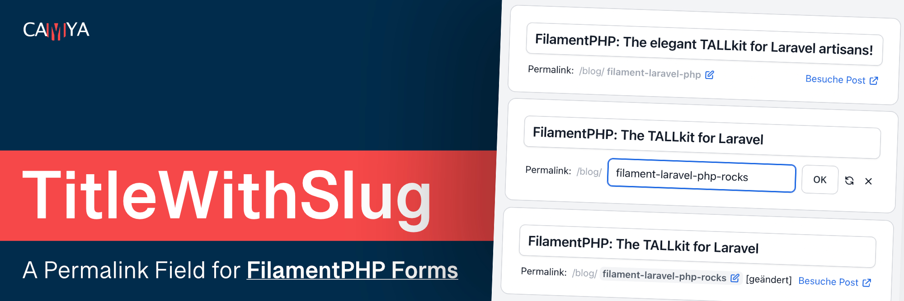
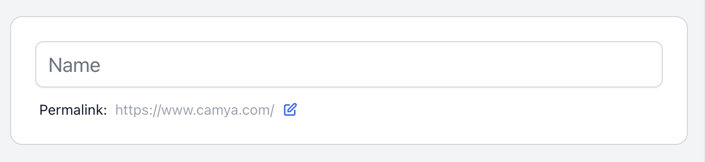
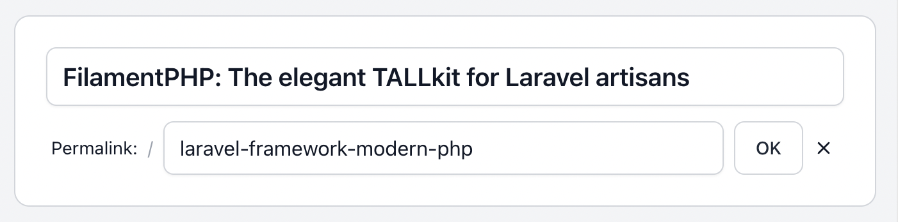
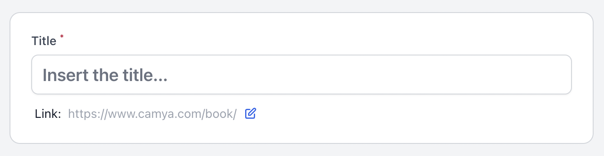
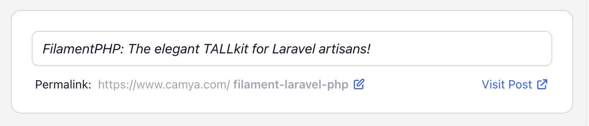
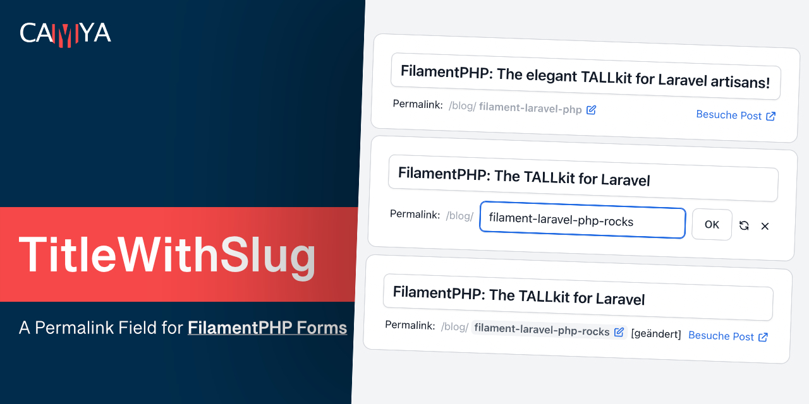

# TitleWithSlugInput - Easy Permalink Slugs for the FilamentPHP Form Builder - Laravel Livewire

This [FilamentPHP](https://filamentphp.com/) Form Builder package by [camya](https://www.camya.com) adds a form field to easily add
and edit titles with slugs.

This plugin is inspired by the classic WordPress title & slug implementation.

```php
TitleWithSlugInput::make(
    fieldTitle: 'title', // The name of the field in your model that stores the title.
    fieldSlug: 'slug', // The name of the field in your model that will store the slug.
),
```

**Features**

- Slug edit form.
- "Visit" link to view the final URL.
- Auto-generates the slug from the title, if it has not already been manually updated.
- Undo an edited slug.
- All texts customizable and translatable.
- Fully configurable, see [all available parameters](#all-available-parameters).

Watch **[&raquo; Demo Video &laquo;](https://www.youtube.com/watch?v=uMdilJpxdf4)**

[](https://www.youtube.com/watch?v=uMdilJpxdf4)

## Support us

This package is developed by [camya.com](https://www.camya.com). You
can [follow us on Twitter](https://twitter.com/camyaCom) for DEV updates.

You can support our work by [donations](https://www.camya.com).

## Table of contents

- [Installation](#installation)
- [Usage & examples](#usage--examples)
    - [Basic usage - Add it to the Filament Form](#basic-usage---add-it-to-the-filament-form)
    - [Change model fields names](#change-model-fields-names)
    - [Change labels, titles, placeholder, and basePath](#change-labels-titles-placeholder-and-basepath)
    - [Style the "title" input field](#style-the-title-input-field)
    - [Add extra validation rules for title or slug](#add-extra-validation-rules-for-title-or-slug)
    - [Custom error messages](#custom-error-messages)
    - [Custom unique validation rules for title (and slug)](#custom-unique-validation-rules-for-title-and-slug)
    - [Generate route for "Visit" link](#generate-route-for-visit-link)
    - [Custom slugifier](#custom-slugifier)
    - [**All available parameters**](#all-available-parameters)
- [Changelog](#changelog)
- [Contributing](#contributing)
- [Credits](#credits)

## Installation

You can install the package via composer:

```bash
composer require camya/filament-title-with-slug
```

If needed, you can publish the config file with:

```bash
php artisan vendor:publish --tag="filament-title-with-slug-config"
```

If needed, you can publish the translation files with:

```bash
php artisan vendor:publish --tag="filament-title-with-slug-translations"
```

This plugin in translated to: [english](https://github.com/camya/filament-title-with-slug/blob/main/resources/lang/en/package.php)

## Usage & examples

### Basic usage - Add it to the Filament Form

This package provides the custom InputField `TitleWithSlugInput` for the Filament Form Builder. 

Read the [installation details for Filament](https://filamentphp.com/docs/2.x/admin/installation) here.

Below an example, where to put the new field inside your Filament Resource.

- `fieldTitle`: The name of the field in your model that stores the title.
- `fieldSlug`: The name of the field in your model that will store the slug.

```php
class PostResource extends Resource
{
    public static function form(Form $form): Form
    {
        return $form->schema([
        
            TitleWithSlugInput::make(
                fieldTitle: 'title',
                fieldSlug: 'slug',
            )
            
        ]);
    }
}
```

> **Tip:** To occupy the full width, use `TitleWithSlugInput::make()->columnSpan('full')`.

### Change model fields names

The package assumes, that you model fields are named `title` and `slug`.

You can easily change them according to your needs.

In the example below, the package now uses the database fields `name` for the title and `identifier` for the slug.

```php
TitleWithSlugInput::make(
    fieldTitle: 'name',
    fieldSlug: 'identifier',
)
```

The output looks like this:




### Change labels, titles, placeholder, and path

It's possible to change all labels on the fly.

In this example, we also add the base path `/books/`.

```php
TitleWithSlugInput::make(
    urlPath: '/book/',
    urlVisitLinkLabel: 'Visit Book',
    titleLabel: 'Title',
    titlePlaceholder: 'Insert the title...',
    slugLabel: 'Link:',
)
```

The output looks like this:




### Style the "title" input field

In order to style the "title" input field, you can pass the attributes `class` via `titleExtraInputAttributes`
parameter.

```php
TitleWithSlugInput::make(
    titleExtraInputAttributes: ['class' => 'text-xl font-semibold bg-orange-50'],
)
```

The output looks like this:



### Add extra validation rules for title or slug

You can add additional validation rules by passing in the variables `titleRules` or `slugRules`.

In addition, a unique validation rule is applied to the slug field automatically. In order to modify the unique rule,
read [Custom unique validation rules for title (and slug)](#custom-unique-validation-rules-for-title-and-slug).

```php
TitleWithSlugInput::make(
    titleRules: [
        'required',
        'string',
        'min:3',
        'max:12',
    ],
)
```

You can also [customize the error messages](#custom-error-messages).

### Custom error messages

You can customize the error messages in your EditModel and CreateModel filament resources by adding the $messages member
variable.

```php
protected $messages = [
  'data.slug.regex' => 'Invalid Slug. Use only chars (a-z), numbers (0-9), and the dash (-).',
];
```

### Custom unique validation rules for title (and slug)

Unique validation rules can be modified only by using the parameters `titleRuleUniqueParameters` and
the `slugRuleUniqueParameters` counterpart.

This is needed in order to set Filament's "ignorable" parameter correctly.

```php
TitleWithSlugInput::make(
    titleRuleUniqueParameters: [
        'callback' => fn(Unique $rule) => $rule->where('is_published', 1),
        'ignorable' => fn(?Model $record) => $record,
    ],
)
```

This array is inserted into the input field's `->unique(...[$slugRuleUniqueParameters])` method.

Read Filament's documentation for the [Unique](https://filamentphp.com/docs/2.x/forms/validation#unique) method.

Available array keys:

```php 
'ignorable' (Model | Closure)
'callback' (?Closure)
'ignoreRecord' (bool)
'table' (string | Closure | null)  
'column' (string | Closure | null) 
```

### Generate route for "Visit" link

This package displays a "view" link for persisted slugs. By default, it simply concatenates the strings host + path +
slug.

If you want to use a "route()" instead, you can configure it as shown below.

```php
TitleWithSlugInput::make(
    visitLinkRoute: fn(?Model $record) => $record?->slug
        ? route('post.show', ['slug' => $record->slug])
        : null,
)
```

### Custom slugifier

This package uses Laravel's slugifier, `Str::slug()`, but it is possible to replace it with one of your own.

The following generates a slug with only the characters a-z and validates them with a regex.

```php
TitleWithSlugInput::make(
    slugSlugifier: fn($string) => preg_replace( '/[^a-z]/', '', $string),
    slugRuleRegex: '/^[a-z]*$/',
)
```

Note: You can customize the validation error, see [Custom error messages](#custom-error-messages).

### All available parameters

You can call TitleWithSlugInput without parameters, and it will work and use its default values.

In order to set parameters, you use [PHP8's Named Arguments](https://laravel-news.com/modern-php-features-explained)
syntax.

```php
TitleWithSlugInput::make(
    fieldTitle: 'title',
    fieldSlug: 'slug',
);
```

Below is an example with some defaults overridden.

```php
TitleWithSlugInput::make(

    // Model fields
    fieldTitle: 'title',
    fieldSlug: 'slug',

    // Url
    urlPath: '/blog/',
    urlHost: 'https://www.camya.com',
    urlHostVisible: true,
    urlVisitLinkLabel: 'View',
    urlVisitLinkRoute: fn(?Model $record) => $record?->slug 
        ? route('post.show', ['slug' => $record->slug])
        : null,

    // Title
    titleLabel: 'The Title',
    titlePlaceholder: 'Post Title',
    titleExtraInputAttributes: ['class' => 'text-xl font-semibold bg-orange-50'],
    titleRules: [
        'required',
        'string',
    ],
    titleRuleUniqueParameters: [
        'callback' => fn(Unique $rule) => $rule->where('is_published', 1),
        'ignorable' => fn(?Model $record) => $record,
    ],
    titleIsReadonly: fn($context, Closure $get) => $context === 'edit' && $get('is_published'),

    // Slug
    slugLabel: 'The Slug: ',
    slugRules: [
        'required',
        'string',
    ],
    slugRuleUniqueParameters: [
        'callback' => fn(Unique $rule) => $rule->where('is_published', 1),
        'ignorable' => fn(?Model $record) => $record,
    ],
    slugIsReadonly: fn($context, Closure $get) => $context === 'edit' && $get('is_published'),
    slugSlugifier: fn($string) => Str::slug($string),
    slugRuleRegex: '/^[a-z0-9\-\_]*$/',

)->columnSpan('full'),
```

## Changelog

Please see [CHANGELOG](CHANGELOG.md) for more information on what has changed recently.

## Contributing

Want to implement a feature, fix a bug, or translate this package? Please see [contributing](.github/CONTRIBUTING.md) for details.

## Security Vulnerabilities

Please review [our security policy](../../security/policy) on how to report security vulnerabilities.

## Credits

- [Andreas Scheibel (camya)](https://github.com/camya) (Developer at  [camya.com](https://www.camya.com) & [epicbundle.com](https://www.epicbundle.com))

FilamentPHP is based on
[Laravel](https://laravel.com/),
[Livewire](https://laravel-livewire.com/),
[AlpineJS](https://alpinejs.dev/),
and
[TailwindCSS](https://tailwindcss.com/). (aka Tall Stack)

This package was inspired by a package
by [awcodes](https://github.com/awcodes/) and the work of [spatie](https://github.com/spatie/).

## License

The MIT License (MIT). Please see [License File](LICENSE.md) for more information.

## Tooling - Tools we use

- [PHPStorm](https://www.jetbrains.com/phpstorm/) IDE (+ [Laravel Idea](https://plugins.jetbrains.com/plugin/13441-laravel-idea) Plugin)
- Translations with [DeepL](https://www.deepl.com/translator) and [LanguageTool](https://languagetool.org/)
- [iTerm2](https://iterm2.com/) Terminal
- [Regex101](https://regex101.com/)
- [Markdown TOC Generator](https://luciopaiva.com/markdown-toc/)
- SVG Icons by [Heroicons](https://heroicons.com/)
- [Affinity](https://affinity.serif.com/) Photo & Designer


