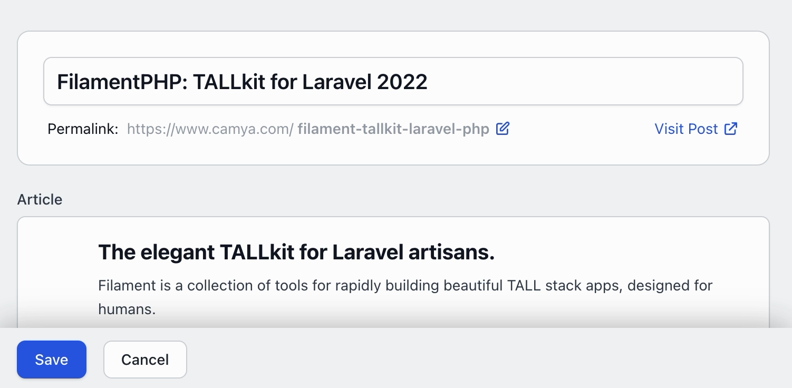
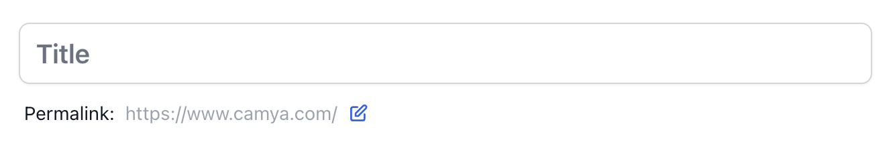
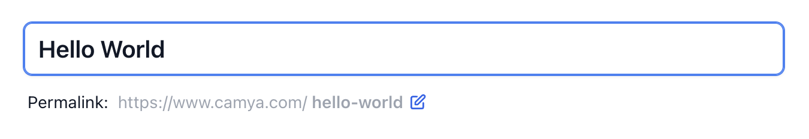
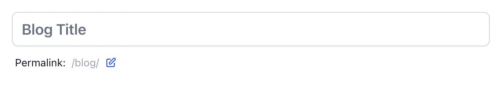
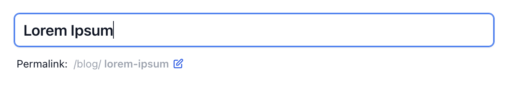
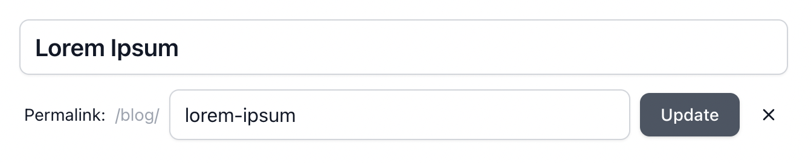
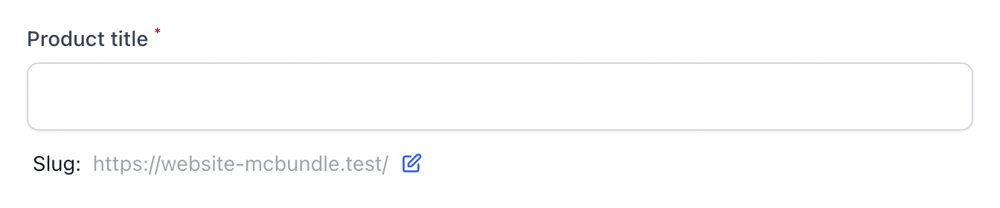

# TitleWithSlugInput - Permalinks for the Filament Form Builder

This [FilamentPHP](https://filamentphp.com/docs/admin/installation) Form Builder package adds a form field to easily add and edit titles with slugs.

This plugin is inspired by the classic WordPress title & slug implementation.

```php
TitleWithSlugInput::make(
    titleField: 'title', // The name of the field in your model that stores the title.
    slugField: 'slug', // The name of the field in your model that will store the slug
),
```

**Features**

- The slug is automatically generated from the title if it has not already been manually updated.
- Update empty slug to regenerate it from the title.
- "View" link to visit the generated url.
- Undo the edited slug.
- Fully configurable, see "All available parameters".

Watch **[&raquo; Demo Video &laquo;](https://www.youtube.com/watch?v=v-AxZv6M1xs)**

[](https://www.youtube.com/watch?v=v-AxZv6M1xs)

## Support us

You can support my work with [donations](https://www.camya.com).

## Installation

You can install the package via composer:

```bash
composer require camya/filament-title-with-slug
```

If needed, you can publish the config file with:

```bash
php artisan vendor:publish --tag="filament-title-with-slug-config"
```

If needed, you can publish the translation files with:

```bash
php artisan vendor:publish --tag="filament-title-with-slug-translations"
```

## Usage

### Example: Change model fields names

The package assumes, that you model fields are named `title` and `slug`.

You can easily change them according to your needs.

```php
TitleWithSlugInput::make(
    titleField: 'title',
    slugField: 'slug',
),
```

The output looks like this:





### Example: Base path and title placeholder

Here we hide the hostname and add the base path `/blog/`.

We also change the placeholder text.

```php
TitleWithSlugInput::make(
    titleField: 'title',
    slugField: 'slug',
    basePath: '/blog/',
    showHost: false,
    titlePlaceholder: 'Blog Title',
),
```

The output looks like this:






### Example: Title above text field & custom slug label

The package automatically inserts a placeholder for the title. If you want to display the regular caption above the text box instead, you can configure it.

You can also specify the caption for the slug.

```php
TitleWithSlugInput::make(
    titleLabel: 'Product title',
    titlePlaceholder: '',
    slugLabel: 'Slug:'
),
```

The output looks like this:



### Example: Add extra validation rules for title or slug

You can add additional validation rules by passing in the variables `titleRules` or `slugRules`. 

```php
TitleWithSlugInput::make(
    titleRules: [
        'required',
        'string',
        'min:3',
        'max:12',
    ],
)
```

You can also [customize the error messages](#custom-error-messages).

### Example: Generate route for View link

This package displays a "view" link for persisted slugs. By default it simply concatenates the strings host + path + slug.

If you want to use a "route()" instead, you can configure it as shown below.

```php
TitleWithSlugInput::make(
    visitLinkRoute: fn(?Model $record) => $record?->slug
        ? route('post.show', ['slug' => $record->slug])
        : null,
),
```

### Example: Custom slugifier

This package uses Laravel's slugifier, `Str::slug()`, but it is possible to replace it with one of your own.

The following generates a slug with only the characters a-z and validates them with a regex.

```php
TitleWithSlugInput::make(
    slugSlugifier: fn($string) => preg_replace( '/[^a-z]/', '', $string),
    slugRuleRegex: '/^[a-z]*$/',
),
```

Note: You can customize the validation error, see "Custom error messages".

### Example: Add additional validation rules

By default, this package applies the `['required','string']` validation rules to both title and slug.

In addition, a unique validation rule is applied to the slug field automatically. (See note below)

```php
TitleWithSlugInput::make(
    titleRules: [
        'required',
        'string',
    ],
),
```

> HINT: Unique validation rules can be modified only by using the parameters `titleRuleUniqueParameters` and the slug counterpart in order to set the "ignorable" correctly.


## All available parameters

You can call TitleWithSlugInput without parameters and it will work and use its default values.

```php
TitleWithSlugInput::make();
```

Below is an example with some defaults overridden.

```php
TitleWithSlugInput::make(

    titleField: 'title',
    slugField: 'slug',

    // Url
    basePath: '/blog/',
    baseHost: 'https://www.camya.com',
    showHost: true,
    visitLinkLabel: 'View',
    visitLinkRoute: fn(?Model $record) => $record?->slug
        ? route('post.show', ['slug' => $record->slug])
        : null,

    // Title
    titleLabel: 'The Title',
    titlePlaceholder: 'Post Title',
    titleClass: '',
    titleRules: [
        'required',
        'string',
    ],
    titleRuleUniqueParameters: [
        'callback' => fn(Unique $rule) => $rule->where('is_published', 1),
        'ignorable' => fn(?Model $record) => $record,
    ],
    titleReadonly: fn($context, Closure $get) => $context === 'edit' && $get('is_published'),

    // Slug
    slugLabel: 'The Slug: ',
    slugRules: [
        'required',
        'string',
    ],
    slugRuleUniqueParameters: [
        'callback' => fn(Unique $rule) => $rule->where('is_published', 1),
        'ignorable' => fn(?Model $record) => $record,
    ],
    slugReadonly: fn($context, Closure $get) => $context === 'edit' && $get('is_published'),
    slugSlugifier: fn($string) => Str::slug($string),
    slugRuleRegex: '/^[a-z0-9\-\_]*$/',

)->columnSpan('full'),
```

## Custom error messages

You can customize the error messages in your EditModel and CreateModel filament resources by adding the $messages member variable.

```php
protected $messages = [
  'data.slug.regex' => 'Invalid Slug. Use chars (a-z), numbers (0-9), underscore (_), and the dash (-).',
];
```

## Changelog

Please see [CHANGELOG](CHANGELOG.md) for more information on what has changed recently.

## Security Vulnerabilities

Please review [our security policy](../../security/policy) on how to report security vulnerabilities.

## Credits

- [camya - Andreas Scheibel](https://github.com/camya)

This package was inspired by [awcodes'](https://github.com/awcodes/filament-addons) filament-addons package.

## License

The MIT License (MIT). Please see [License File](LICENSE.md) for more information.
